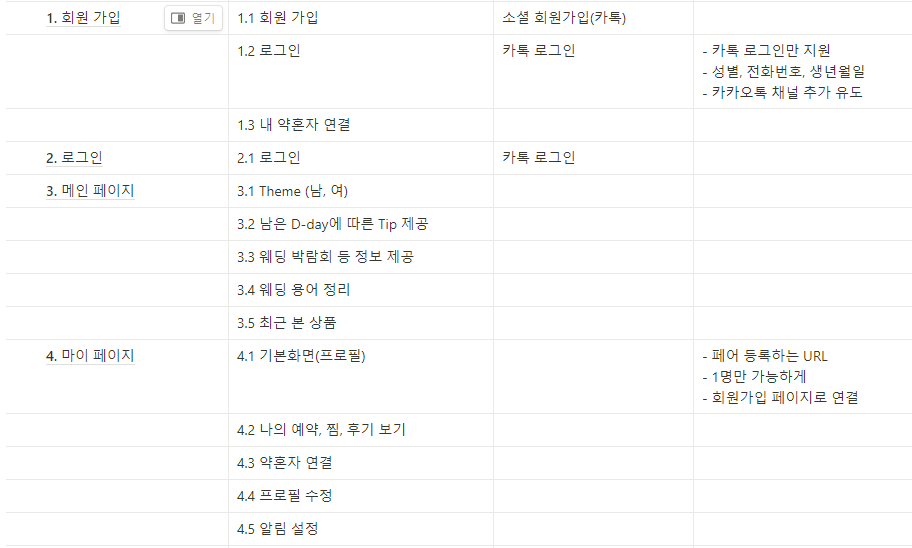
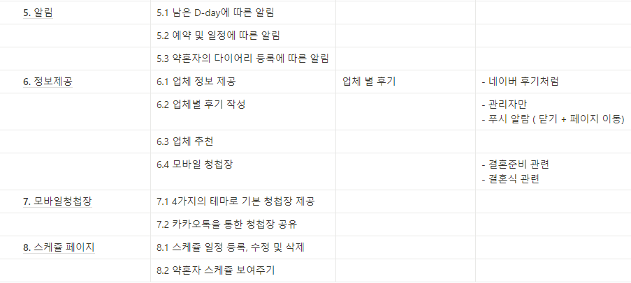
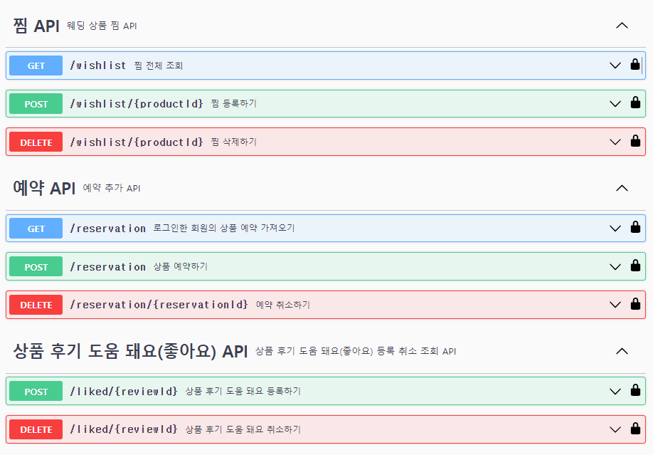
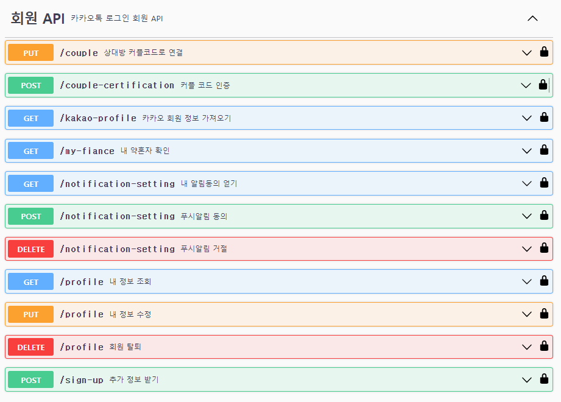
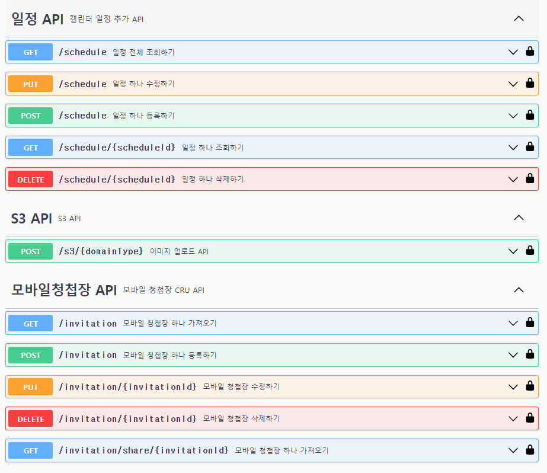
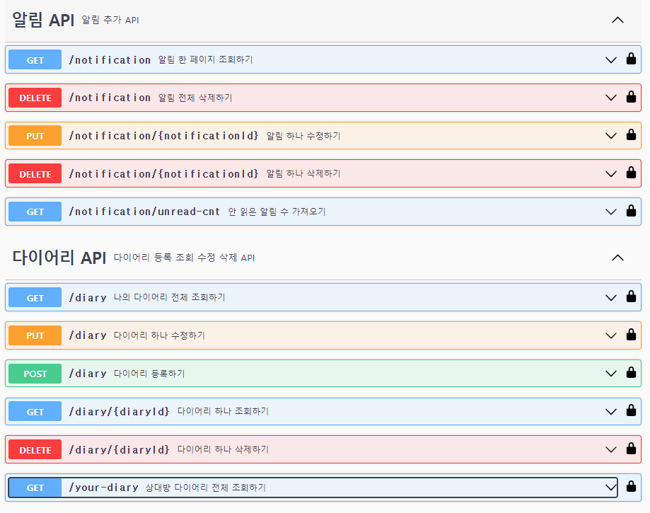
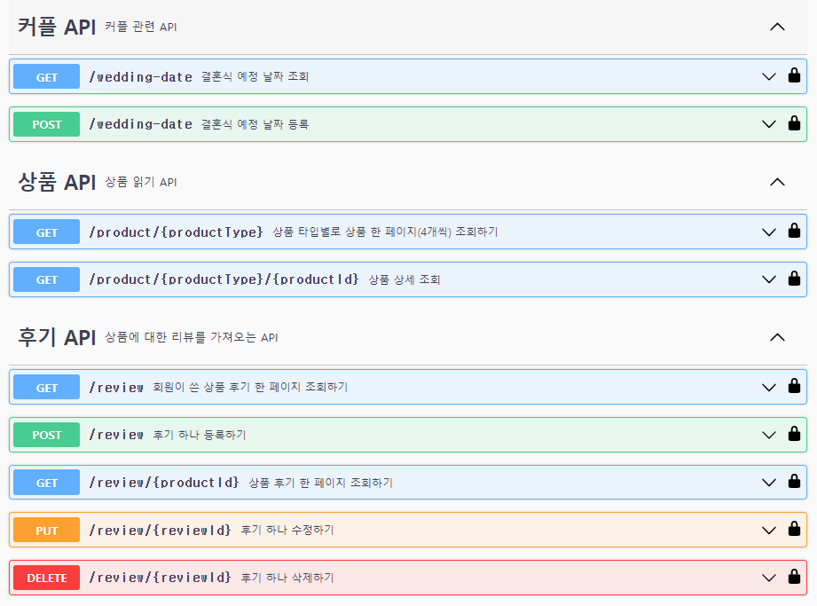
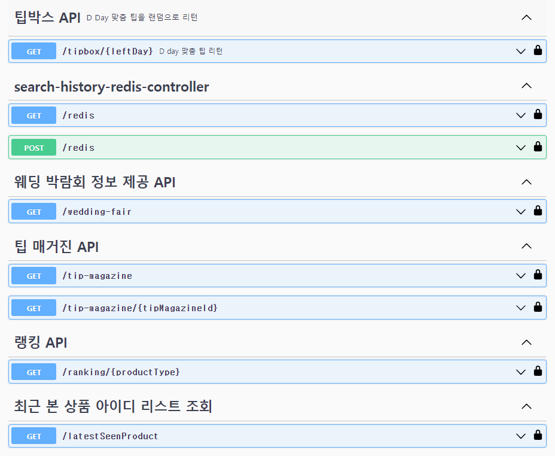
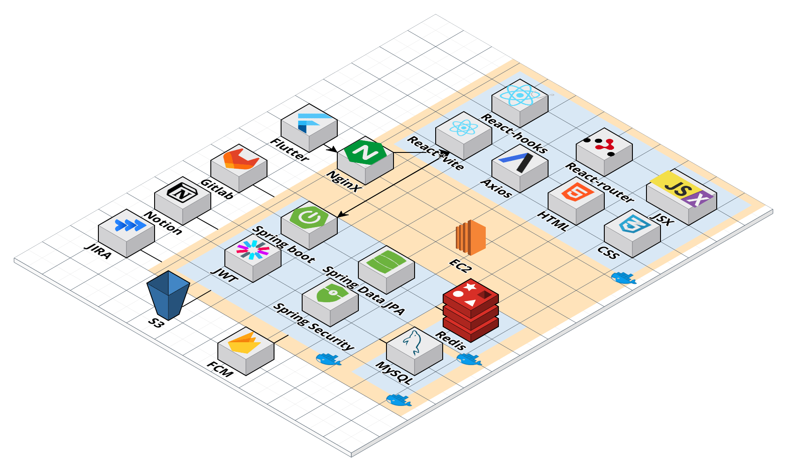

# BLOOMING

모바일 웨딩 플래너

# 목차

1. [결과물](#결과물)
2. [서비스 화면](#서비스-화면)
3. [주요 기능](#주요-기능)
4. [개발 환경](#개발-환경)
5. [기술 소개](#기술-소개)
6. [설계 문서](#설계-문서)
7. [팀원 소개](#팀원-소개)

# 1. 결과물

- 📽 [UCC](https://youtu.be/9v1aKx9SDYE)
- 🎤 [중간 발표 PPT](https://drive.google.com/file/d/1mAaGPRllI2iS1Ac5wJBIb7swqCGSx22H/view?usp=share_link)
- 🎤 [최종 발표 PPT](https://drive.google.com/file/d/14RB6TlOET-WFh-uMFLxWAgyqUoOgS4_n/view?usp=sharing)

# 서비스 화면

## ✅회원 가입# 목차

1. [결과물](#결과물)
2. [서비스 화면](#서비스-화면)
3. [주요 기능](#주요-기능)
4. [개발 환경](#개발-환경)
5. [기술 소개](#기술-소개)
6. [설계 문서](#설계-문서)
7. [팀원 소개](#팀원-소개)

# 결과물

- 📽 [UCC](https://youtu.be/9v1aKx9SDYE)

- 🎤 [중간 발표 PPT](https://drive.google.com/file/d/1mAaGPRllI2iS1Ac5wJBIb7swqCGSx22H/view?usp=share_link)

- 🎤 [최종 발표 PPT](https://drive.google.com/file/d/14RB6TlOET-WFh-uMFLxWAgyqUoOgS4_n/view?usp=sharing)
  
  # 서비스 화면

 

 

- 카카오 로그인 성공 시, 서비스에 등록된 회원이 아니라면 회원가입 진행
- 커플 코드가 있으면 커플 코드를 등록하고 진행
- 신랑, 신부와 이름을 입력하고 (기본적으로 카카오로그인시 성별과 이름을 가져와서 기본값으로 지정해줌)
- 이후, 전화번호와 닉네임을 설정
- 결혼식 날짜가 정해졌으면 남은 D-day에 따른 Tip과 알림 요청 기능 제공

## 🕒메인 페이지

 

 

- ## 🏃‍♂️정보 페이지

 

 

- `현재 위치 기반 0~10km` 까지 거리 설정 가능
- `일자`, `시간`, `게임 종류`, `게임 시간`, `성별` 필터 제공
- `시간 순`, `인원 순`, `거리 순`으로 검색된 모임 정렬 가능

## 💭스케쥴 페이지

 

 

- 운동 모임, 또는 팀 채팅방에서 사람들과 채팅 가능

## 📑 다이어리 페이지

 

 

- `자신이 참여한 모든 운동 모임` 확인 가능
- ">" 버튼 클릭 시 `매칭 상세 정보 확인 가능`
- `팀 매칭 정보` 확인 가능

## 👨🏼‍🤝‍👨🏼마이 페이지

 

 

- 전체 목록의 `팀 생성 탭`, 혹은 `팀 매칭 페이지`에서 팀 생성 가능
- `운동 종목`을 선택, `친구를 추가`하고 `팀 정보를 입력`하여 팀 생성
- 팀 생성 시 `팀 채팅방`도 같이 생성됨

# 주요 기능

- ##### 1. 알림 기능
  
  - ###### D-day 에 따른 알림
  - ###### 예약 및 스케쥴에 따른 알림
  - ###### 다이어리 작성에 따른 알림

 

- ##### 2. 다이어리 기능
  
  - ###### 내 다이어리
  
  - ###### 약혼자 다이어리

 

- ##### 3. 모바일 청첩장
  
  - ###### 작성 후 카카오톡을 이용한 공유

# 개발 환경

## ⚙ Management Tool

- 형상 관리 : Gitlab
- 이슈 관리 : Jira
- 커뮤니케이션 : Mattermost, Webex, Notion, Discord
- 디자인 : Figma, PowerPoint

## 💻 IDE

- Visual Studio Code `1.18.1`
- IntelliJ `11.0.19`

## 📱 Frontend

- React `18.2.0`
- Vite `^4.4.5`
- Recoil `^0.7.7`
- React-Router-Dom `6.14.2`
- Library
  - antd : `^5.7.3`
  - antd-mobile : `^5.32.0`
  - axios : `^1.4.0`
  - clipboard-copy : `^4.0.1`
  - dayjs : `^1.11.9`
  - framer-motion : `^10.13.0`
  - gsap : `^3.12.2`
  - qrcode : `^1.5.2`
  - react-calendar : `^4.5.0`
  - react-datepicker : `^4.16.0`
  - react-dom : `^18.2.0`
  - react-icons : `4.10.1`
  - react-infinite-scroll-component : `^6.1.0`
  - react-kakao-link : `^0.1.2`
  - react-loading-skeleton : `^3.3.1`
  - react-pageflip : `^2.0.3`
  - react-rating : `2.0.5`
  - react-responsice-carousel : `^3.2.23`
  - react-slick : `^0.29.0`
  - react-swipeable : `^7.0.1`
  - react-swipable-list : `^1.8.1`
  - slick-carousel : `^1.8.1`
  - styled-components : `^6.0.7`
- Flutter
  - library
    - inapp_webview
- Android Studio

## 💾 Backend

- Springboot `2.7.13`
- Lombok
- Spring Data JPA 
- Spring Data Redis(lettuce)
- Spring Web
- Springdoc-openapi-ui `1.6.11`
- Oauth2
- Swagger 3.0.0
- SSL
- Oauth2
- CertBot(CA Certificates)
- Redis
- MySql 8.0.34

# 기술 소개

- 웹 기반 하이브리드 어플리케이션
  
  - `Flutter`를 활용하여 웹 및 앱 플랫폼 모두 사용 가능
  - 

- 사용자 알림
  
  - `Firebase Cloud Message`를 이용하여 사용자에게 필요한 알림 제공

- 실시간 채팅
  
  - `WebSocket`을 통하여 서버/클라이언트 통신 구현
  - `Stomp` 메세지 브로커를 활용하여 1:N의 관계 구축
  - `Redis`를 활용하여 채팅방을 유지하고 여러대의 채팅 서버간에 메세지를 주고 받음

- 필터링
  
  - 사용자가 원하는 `조건`으로 `검색`하면 원하는 결과를 얻을 수 있도록 함

- 자동 매칭
  
  - `ELO알고리즘` 기반 레이팅 시스템을 사용하여 비슷한 수준의 팀끼리 매칭될 수
    있도록 함

- 카카오 로그인
  
  - `OAUTH2` 인증을 이용해 불필요한 개인정보 입력 최소화

- Spring Cloud Gateway
  
  - 하나의 주소로 서버에 접속할 수 있도록 `패킷 분배`
  - 한가한 서버에게 업무를 배정하여 효율성을 증가시킬 수 있도록 `로드밸런싱`
  - 특정 사용자의 요청을 차단하여 `해킹 공격 방어`

- 해킹 대응
  
  - `Docker Hub`에 이미지를 업로드하고 이를 활용하여 재설치 시간을 단축
  - 해킹 서버를 받은 서버가 작동이 불가능하면 명령어 하나만으로 `자동으로 모든 서비스를 정상화`
  - Jenkins를 사용하지 않아야 할 때 `명령어 하나만`으로 수동 CI/CD 가능하도록 `Shell script`로 구현

# 설계 문서

## 🎨 와이어프레임

## 📃 기능 명세서

## 📝 API 명세서

## 📏 ERD

## 📐 시스템 아키텍처

# 팀원 소개

| **[정훈석](https://github.com/AndreaStudy)**                                                          | **[정소정](https://github.com/sojeong025)**                                                           | **[구희영](https://github.com/hi9900)**                                                               | **[강동윤](https://github.com/yty455)**                                                               | **[김성인](https://github.com/ksi2564)**                                                              | **[김승연](https://github.com/ksy00826)**                                                             |
|:--------------------------------------------------------------------------------------------------:|:--------------------------------------------------------------------------------------------------:|:--------------------------------------------------------------------------------------------------:|:--------------------------------------------------------------------------------------------------:|:--------------------------------------------------------------------------------------------------:|:--------------------------------------------------------------------------------------------------:|
|  |  |  |  |  |  |
| Frontend                                                                                           | Frontend                                                                                           | Frontend                                                                                           | Backend                                                                                            | Backend                                                                                            | Backend                                                                                            |

## 😎 역할 분담

**Frontend**

- 정훈석 : 
- 정소정 : UX/UI 설계, PPT제작, 영상 제작
- 구희영 : UX/UI 설계

**Backend**

- 강동윤: 

- 김성인 : 

- 김승연 : 
