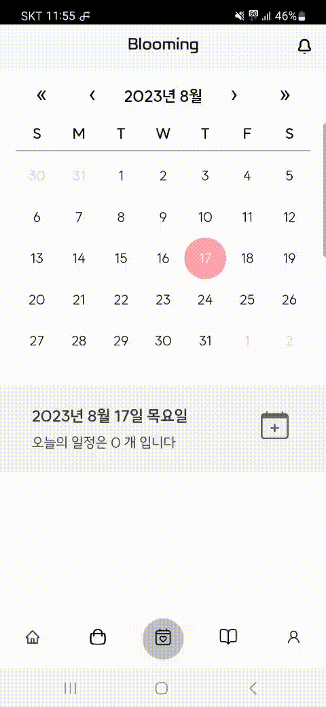
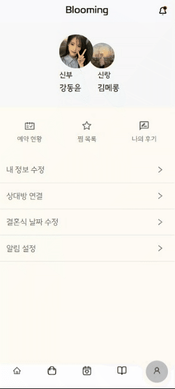
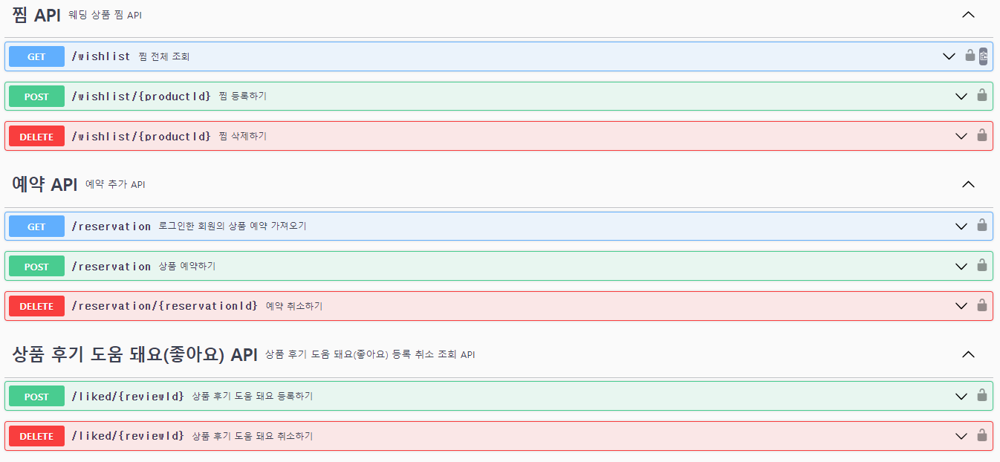
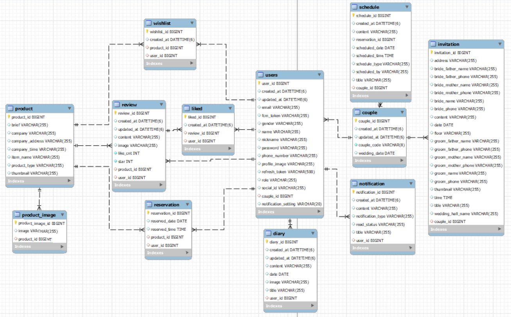
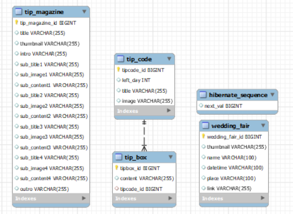

# 🥇 BLOOMING 

## 목차
1. [개요](#개요)
2. [개발 환경](#개발-환경)
3. [서비스 화면](#서비스-화면)
4. [주요 기능](#주요-기능)
5. [기술 소개](#기술-소개)
6. [설계 문서](#설계-문서)
7. [팀원 소개](#팀원-소개)
 

## 개요
> <b>프로젝트 기간</b> : 2023/07/10 ~ 2023/08/18  
> <b>참고자료 </b> : 🎞 [UCC](https://youtu.be/o2EBLNdY8w4)
📃 [최종발표 PPT](https://drive.google.com/file/d/1Zd7H1pnseM33wLsKeWNzw6r47Dtfco3s/view?usp=sharing)
 

## 개발 환경
#### ⚙ Management Tool
    

#### 💻 IDE
  

#### 🌌Infra
    

#### 📱 Frontend
 

     

#### 💾 Backend
      

 

## 서비스 화면

#### 랜딩 페이지
|  |  |
| :----: | :----: |
|<b>랜딩 페이지 </b>|<b> 회원 가입</b>|

- 카카오 로그인 성공 시, 서비스에 등록된 회원이 아니라면 회원가입 진행
- 커플 코드가 있으면 커플 코드를 등록하고 진행
- 신랑, 신부와 이름을 입력하고 (기본적으로 카카오로그인시 성별과 이름을 가져와서 기본값으로 지정해줌)
- 이후, 전화번호와 닉네임을 설정
- 결혼식 날짜가 정해졌으면 남은 D-day에 따른 Tip과 알림 요청 기능 제공

 

#### 메인 페이지
|  |  |||
| :----: | :----: | :----: | :----: |
|<b>메인 페이지 </b>|<b> 결혼 준비 정보</b>|<b>웨딩 박람회</b>|<b>최근 본 상품</b>|

- 메인페이지에서 Dday에 따른 Tip, 웨딩 박람회, 결혼 준비에 대한 TIP 등 다양한 정보를 얻을 수 있음.
- 결혼 준비에 대한 TIP에서는 결혼 용어에 대한 특징 등 여러가지에 대한 정보를 얻을 수 있음.
- 박람회에 대한 정보를 얻을 수 있음.
- 최근 본 상품에 대한 정보를 얻을 수 있음.

 

#### 웨딩 업체 정보

|  |  |  |
| :----: | :----: | :----: |
|<b>웨딩홀 예약</b>|<b>후기 작성</b>|<b>후기 좋아요</b>|

- 정보페이지에는 웨딩홀, 스튜디오, 드레스, 메이크업, 모바일 청첩장 페이지가 있음.
- 모바일 청첩장을 제외한 4개의 페이지는 각각 상품에 대한 찜과 예약하기 기능이 있음.
- 예약을 하면 자동으로 해당 날짜와 시간에 일정이 생성이 되며 일정 디테일로 이동합니다. 세부적인 내용을 수정을 통해 자세히 적을 수 있습니다.
- 각각의 상품에는 별점과 함께 후기를 줄 수 있다.
- 적혀진 리뷰에 대해 도움이 돼요 버튼이 존재.
- 청첩장 만들기를 통해 본인만의 메시지를 담은 모바일 청첩장 페이지가 존재하고 카카오톡 공유하기 버튼을 통해 카카오톡으로 해당 페이지에 대한 공유 가능

 

#### 모바일 청첩장
|  |
| :----: |
|<b>모바일 청첩장 제작</b>|

 

#### 스케쥴 페이지

|  |  |  |
| :----: | :----: | :----: |
|<b>일정 등록</b>|<b>약혼자 일정 등록 알림</b>|<b>일정 리마인드 알림</b>|

- 개인일정을 스케쥴 페이지에서 등록이 가능하며, 등록된 약혼자의 일정과 공유하는 일정을 확인할 수 있다.
- 스케쥴을 등록하면 약혼자에게도 알림을 전달하여 어떤 일정이 등록되었는지 알려준다.
- 등록된 일정도 30일 7일 1일 당일에 리마인드 알림을 준다.

 

#### 다이어리 페이지

|  |       |||
| :----: | :----: | :----: | :----: |
|<b>다이어리 설명</b>|<b>다이어리 페이지</b>|<b>다이어리 작성</b>|<b>커플 다이어리</b>|

- 다이어리페이지는 작성에대한 설명과함께 작성페이지로 이동할 수 있음
- 메인페이지에서는 자신이 작성한 다이어리와 약혼자가 작성한 다이어리를 보여주며 약혼자의 다이어리는 개수를 알 수 있으나 내용을 확인할 수는 없습니다.
- 다이어리 작성에는 기본적인 사진과 제목, 내용이 입력가능합니다.
- 결혼식 당일이 되면 약혼자의 다이어리에 대한 정보 확인할 수 있습니다.

 

#### 마이 페이지

||||
| :----: | :----: | :----: |
|<b>약혼자 등록</b>|<b>약혼자 연결 전 후 프로필</b>|<b>푸시 알림 설정</b>|
|||  |
|<b>나의 후기</b>|<b>찜 등록</b>|<b>찜 목록</b>|

- 커플코드는 가입할 때 입력을 할 수 있으나, 입력하지 않고 건너갔을 경우에 마이페이지에 있는 상대방과 연결하기를 통해서 이름과 커플코드를 입력하여 확인을 거친 후 연결이 가능(연결은 1명과 가능하며, 이미 연결이 된 사람과의 연결은 불가합니다.)
- 커플 코드 연결을 성공하면 프로필에 약혼자의 프로필이 꼭 붙어 나타납니다
- PUSH알림 설정을 통해 푸쉬 설정을 ON / OFF 설정이 가능합니다.
- 마이페이지 나의 후기를 통해 내가 작성한 모든 후기를 볼 수 있으며, 후기 클릭 시 해당 상품디테일로 이동합니다.
- 찜에 등록이 된 상품은 마이페이지의 찜목록에 들어가 있으며, 내가 찜한 거와 약혼자가 찜한 거 그리고 동시에 찜한 상품을 확인할 수 있습니다.

 

## 기술 소개

- 웹 기반 하이브리드 어플리케이션
  
  - `Flutter`를 활용하여 웹 및 앱 플랫폼 모두 사용 가능

- 사용자 알림
  
  - `Firebase Cloud Message`를 이용하여 사용자에게 필요한 알림 제공, `Redis`를 이용한 FCM Token 관리

- 카카오 로그인
  
  - `OAUTH2` 인증을 이용해 불필요한 개인정보 입력 최소화

- 상품 실시간 예약 랭킹, 최근 본 상품
  
  - in-memory DB인 `Redis`의 sorted set 자료구조를 이용해 실시간 예약 랭킹과 사용자별 최근 본 상품 정보 제공

 

## 설계 문서

#### 🎨 와이어프레임

#### 📃 기능 명세서

#### 📝 API 명세서

#### 📏 ERD

#### 📐 시스템 아키텍처

## 팀원 소개

| **[정훈석](https://github.com/AndreaStudy)**                                                          | **[정소정](https://github.com/sojeong025)**                                                           | **[구희영](https://github.com/hi9900)**                                                               | **[강동윤](https://github.com/yty455)**                                                               | **[김성인](https://github.com/ksi2564)**                                                              | **[김승연](https://github.com/ksy00826)**                                                             |
|:--------------------------------------------------------------------------------------------------:|:--------------------------------------------------------------------------------------------------:|:--------------------------------------------------------------------------------------------------:|:--------------------------------------------------------------------------------------------------:|:--------------------------------------------------------------------------------------------------:|:--------------------------------------------------------------------------------------------------:|
|  |  |  |  |  |  |
| Frontend                                                                                           | Frontend                                                                                           | Frontend                                                                                           | Backend                                                                                            | Backend                                                                                            | Backend                                                                                            |

#### 😎 역할 분담

**Frontend**

- 정훈석 : 프론트 Token 처리 / Flutter / 카카오톡 공유하기 / 리액트 베이스 코드 제작 / 에러 수정
- 정소정 : UX/UI 설계 / PPT제작 / 영상 제작 / 발표 / 모바일 청첩장 페이지 제작
- 구희영 : UX/UI 설계 / PPT제작 / Route 설정 /회원 정보, 상품 정보, 마이페이지 제작

**Backend**

- 강동윤: Fluttter / infra 구축 / 다이어리, 찜하기, 도움돼요 API 제작

- 김성인 : DB설계 및 구축 / 회원(Oauth, JWT) 관련 API / S3 / 커플, 회원 등 API 제작

- 김승연 : 상품 크롤링 및 기타 API / FCM 알림 / Redis를 이용한 예약 랭킹 및 최근 본 상품 리스트 API 제작
